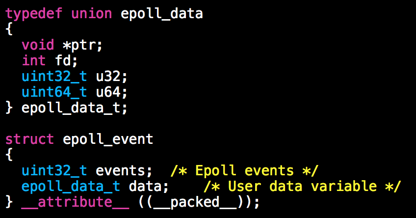
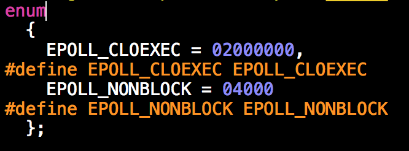
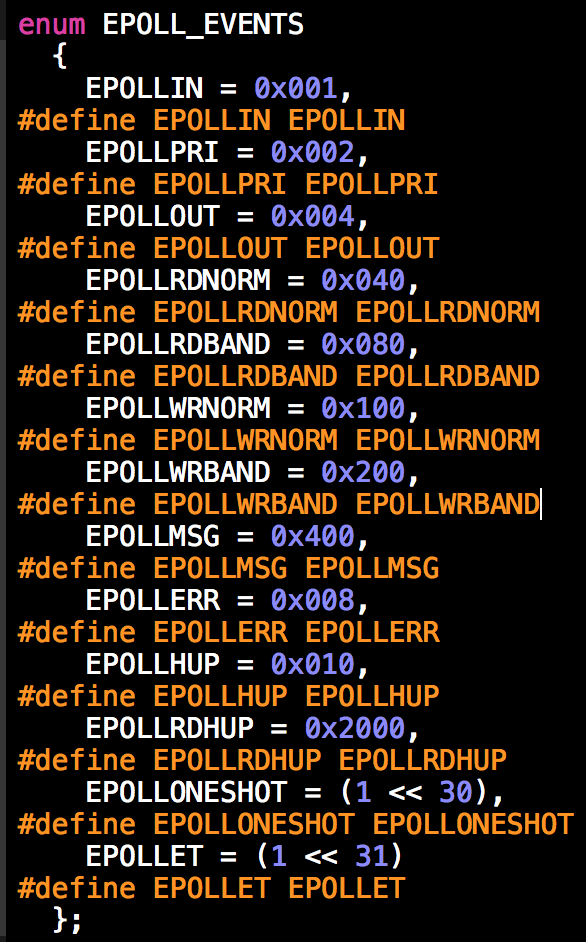
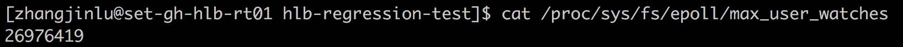

每每忘记细节引起争辩，得有个地方把所有相关知识点收集起来

## 1.1. 接口

按如下代码顺序讲解接口：

```
           #define MAX_EVENTS 10
           struct epoll_event ev, events[MAX_EVENTS];
           int listen_sock, conn_sock, nfds, epollfd;

           /* Code to set up listening socket, 'listen_sock',
              (socket(), bind(), listen()) omitted */

           epollfd = epoll_create1(0);
           if (epollfd == -1) {
               perror("epoll_create1");
               exit(EXIT_FAILURE);
           }

           ev.events = EPOLLIN;
           ev.data.fd = listen_sock;
           if (epoll_ctl(epollfd, EPOLL_CTL_ADD, listen_sock, &ev) == -1) {
               perror("epoll_ctl: listen_sock");
               exit(EXIT_FAILURE);
           }

           for (;;) {
               nfds = epoll_wait(epollfd, events, MAX_EVENTS, -1);
               if (nfds == -1) {
                   perror("epoll_wait");
                   exit(EXIT_FAILURE);
               }

               for (n = 0; n < nfds; ++n) {
                   if (events[n].data.fd == listen_sock) {
                       conn_sock = accept(listen_sock,
                                          (struct sockaddr *) &addr, &addrlen);
                       if (conn_sock == -1) {
                           perror("accept");
                           exit(EXIT_FAILURE);
                       }
                       setnonblocking(conn_sock);
                       ev.events = EPOLLIN | EPOLLET;
                       ev.data.fd = conn_sock;
                       if (epoll_ctl(epollfd, EPOLL_CTL_ADD, conn_sock,
                                   &ev) == -1) {
                           perror("epoll_ctl: conn_sock");
                           exit(EXIT_FAILURE);
                       }
                   } else {
                       do_use_fd(events[n].data.fd);
                   }
               }
           } 
```

### 1.1.1. epoll_event



struct epoll_event ev;
ev.events = EPOLLIN;
ev.data.fd = listen_sock; 要被监听事件的fd，在上例中是个listenfd

### 1.1.2. epoll_create

```
/* Creates an epoll instance.  Returns an fd for the new instance.
   The "size" parameter is a hint specifying the number of file
   descriptors to be associated with the new instance.  The fd
   returned by epoll_create() should be closed with close().  */
extern int epoll_create (int __size) __THROW;
```

创建一个epoll队列，返回该epoll队列的fd。 这个入参__size在linux内核2.6.8+就不再用了，保留参数是为了向下兼容。

记得对fd调用close

size相关解释：In the initial **epoll_create**() implementation, the *size* argument informed the kernel of the number of file descriptors that the caller expected to add to the **epoll** instance. The kernel used this information as a hint for the amount of space to initially allocate in internal data structures describing events. (If necessary, the kernel would allocate more space if the caller's usage exceeded the hint given in *size*.) Nowadays, this hint is no longer required (the kernel dynamically sizes the required data structures without needing the hint), but *size* must still be greater than zero, in order to ensure backward compatibility when new **epoll** applications are run on older kernels.

### 1.1.3. epoll_create1

```
extern int epoll_create1 (int __flags) __THROW;
```

flag=0的话与epoll_create相同

可以传2个flag：



**EPOLL_CLOEXEC：**(since Linux 2.6.23) 能够保证该epoll fd正确设置成“退出时关闭”(不用调用close)，即使有fork也不会引起竞争导致fd泄露(比如 main create fd -- fork – fcntl ( fd, F_SETFL, flag | O_CLOEXEC ) )

By default, the new file descriptor is set to remain open across an [execve(2)](http://man7.org/linux/man-pages/man2/execve.2.html) .Note that the use of this flag is essential in some multithreaded programs, because using a separate [fcntl(2)](http://man7.org/linux/man-pages/man2/fcntl.2.html)**F_SETFD** operation to set the FD_CLOEXEC flag does not suffice to avoid race conditions where one thread opens a file descriptor and attempts to set its close-on-exec flag using [fcntl(2)](http://man7.org/linux/man-pages/man2/fcntl.2.html) at the same time as another thread does a [fork(2)](http://man7.org/linux/man-pages/man2/fork.2.html) plus [execve(2)](http://man7.org/linux/man-pages/man2/execve.2.html). Depending on the order of execution, the race may lead to the file descriptor returned by **open**() being unintentionally leaked to the program executed by the child process created by [fork(2)](http://man7.org/linux/man-pages/man2/fork.2.html). (This kind of race is in principle possible for any system call that creates a file descriptor whose close-on-exec flag should be set, and various other Linux system calls provide an equivalent of the O_CLOEXEC flag to deal with this problem.)

 **EPOLL_NONBLOCK**：epoll.h说是可以设置，但其实并没有文档解释。不好猜，暂时搁置

### 1.1.4. epoll_event.events



事件有：

 **EPOLLIN** The associated file is available for [read(2)](http://man7.org/linux/man-pages/man2/read.2.html) operations. **EPOLLOUT** The associated file is available for [write(2)](http://man7.org/linux/man-pages/man2/write.2.html) operations. **EPOLLRDHUP** (since Linux 2.6.17) Stream socket peer closed connection, or shut down writing half of connection. (This flag is especially useful for writ‐ ing simple code to detect peer shutdown when using Edge Trig‐ gered monitoring.) **EPOLLPRI** There is an exceptional condition on the file descriptor. See the discussion of **POLLPRI** in [poll(2)](http://man7.org/linux/man-pages/man2/poll.2.html). There is some exceptional condition on the file descriptor.

 Possibilities include: * There is out-of-band data on a TCP socket (see [tcp(7)](http://man7.org/linux/man-pages/man7/tcp.7.html)). * A pseudoterminal master in packet mode has seen a state change on the slave (see [ioctl_tty(2)](http://man7.org/linux/man-pages/man2/ioctl_tty.2.html)). * A *cgroup.events* file has been modified (see [cgroups(7)](http://man7.org/linux/man-pages/man7/cgroups.7.html)).

**EPOLLERR 即使不设置也会被触发的** Error condition happened on the associated file descriptor. This event is also reported for the write end of a pipe when the read end has been closed. [epoll_wait(2)](http://man7.org/linux/man-pages/man2/epoll_wait.2.html) will always report for this event; it is not necessary to set it in *events*. **EPOLLHUP 即使不设置也会被触发的**

 Hang up happened on the associated file descriptor. [epoll_wait(2)](http://man7.org/linux/man-pages/man2/epoll_wait.2.html) will always wait for this event; it is not nec‐ essary to set it in *events*. Note that when reading from a channel such as a pipe or a stream socket, this event merely indicates that the peer closed its end of the channel. Subsequent reads from the channel will return 0 (end of file) only after all outstanding data in the channel has been consumed. **EPOLLET 事件设置为边沿触发** Sets the Edge Triggered behavior for the associated file descriptor. The default behavior for **epoll** is Level Trig‐ gered. See [epoll(7)](http://man7.org/linux/man-pages/man7/epoll.7.html) for more detailed information about Edge and Level Triggered event distribution architectures. **EPOLLONESHOT** (since Linux 2.6.2) fd只被触发一次 Sets the one-shot behavior for the associated file descriptor. This means that after an event is pulled out with [epoll_wait(2)](http://man7.org/linux/man-pages/man2/epoll_wait.2.html) the associated file descriptor is internally disabled and no other events will be reported by the **epoll** interface. The user must call **epoll_ctl**() with **EPOLL_CTL_MOD** to rearm the file descriptor with a new event mask. **EPOLLWAKEUP** (since Linux 3.5) If **EPOLLONESHOT** and **EPOLLET** are clear and the process has the **CAP_BLOCK_SUSPEND** capability, ensure that the system does not enter "suspend" or "hibernate" while this event is pending or being processed. The event is considered as being "processed" from the time when it is returned by a call to [epoll_wait(2)](http://man7.org/linux/man-pages/man2/epoll_wait.2.html) until the next call to [epoll_wait(2)](http://man7.org/linux/man-pages/man2/epoll_wait.2.html) on the same [epoll(7)](http://man7.org/linux/man-pages/man7/epoll.7.html) file descriptor, the closure of that file descriptor, the removal of the event file descriptor with **EPOLL_CTL_DEL**, or the clear‐ ing of **EPOLLWAKEUP** for the event file descriptor with **EPOLL_CTL_MOD**. See also BUGS.

 If the system is in **autosleep** mode via */sys/power/autosleep* and an

 event happens which wakes the device from sleep, the device driver will keep the device awake only until that event is queued. To keep the device awake until the event has been processed, it is necessary to use the [epoll_ctl(2)](http://man7.org/linux/man-pages/man2/epoll_ctl.2.html)**EPOLLWAKEUP** flag. When the **EPOLLWAKEUP** flag is set in the **events** field for a *structepoll_event*, the system will be kept awake from the moment the event is queued, through the [epoll_wait(2)](http://man7.org/linux/man-pages/man2/epoll_wait.2.html) call which returns the event until the subsequent [epoll_wait(2)](http://man7.org/linux/man-pages/man2/epoll_wait.2.html) call. If the event should keep the system awake beyond that time, then a separate *wake_lock* should be taken before the second [epoll_wait(2)](http://man7.org/linux/man-pages/man2/epoll_wait.2.html) call.

**EPOLLEXCLUSIVE** (since Linux 4.5)

一个fd能被塞到多个epoll队列中，当fd有事件发生，会触发多个epoll_wait。本参数可用来解决惊群

比如一个fd被塞到了7个epoll队列中，其中3个event没有指定EPOLLEXCLUSIVE，4个event指定了EPOLLEXCLUSIVE。则当事件发生时，3个未指定参数的event都会被触发，4个指定参数的event中，至少有一个at least one会被触发

 Sets an exclusive wakeup mode for the epoll file descriptor that is being attached to the target file descriptor, *fd*. When a wakeup event occurs and multiple epoll file descriptors are attached to the same target file using **EPOLLEXCLUSIVE**, one or more of the epoll file descriptors will receive an event with [epoll_wait(2)](http://man7.org/linux/man-pages/man2/epoll_wait.2.html). The default in this scenario (when **EPOLLEXCLUSIVE** is not set) is for all epoll file descriptors to receive an event. **EPOLLEXCLUSIVE** is thus useful for avoid‐ ing thundering herd problems in certain scenarios. If the same file descriptor is in multiple epoll instances, some with the **EPOLLEXCLUSIVE** flag, and others without, then events will be provided to all epoll instances that did not specify **EPOLLEXCLUSIVE**, and at least one of the epoll instances that did specify **EPOLLEXCLUSIVE**. The following values may be specified in conjunction with **EPOLLEXCLUSIVE**: **EPOLLIN**, **EPOLLOUT**, **EPOLLWAKEUP,** and **EPOLLET**. **EPOLLHUP** and **EPOLLERR** can also be specified, but this is not required: as usual, these events are always reported if they occur, regardless of whether they are specified in *events*. Attempts to specify other values in *events* yield an error. **EPOLLEXCLUSIVE** may be used only in an **EPOLL_CTL_ADD** operation; attempts to employ it with **EPOLL_CTL_MOD** yield an error. If **EPOLLEXCLUSIVE** has been set using **epoll_ctl**(), then a subse‐ quent **EPOLL_CTL_MOD** on the same *epfd*, *fd* pair yields an error. A call to **epoll_ctl**() that specifies **EPOLLEXCLUSIVE** in *events* and specifies the target file descriptor *fd* as an epoll instance will likewise fail. The error in all of these cases is **EINVAL**.

### 1.1.5. epoll_ctl

```
/* Manipulate an epoll instance "epfd". Returns 0 in case of success,
   -1 in case of error ( the "errno" variable will contain the
   specific error code ) The "op" parameter is one of the EPOLL_CTL_*
   constants defined above. The "fd" parameter is the target of the
   operation. The "event" parameter describes which events the caller
   is interested in and any associated user data.  */
extern int epoll_ctl (int __epfd, int __op, int __fd,
              struct epoll_event *__event) __THROW;
```

op合法参数有三个：

**EPOLL_CTL_ADD**：注册一个event

**EPOLL_CTL_MOD**：修改fd关联的的__event

**EPOLL_CTL_DEL**：把fd从epoll队列中删除，此时不关心__event内容，__event可以为NULL

#### 1.1.5.1. 报错

**EBADF** *epfd* or *fd* is not a valid file descriptor. **EEXIST** *op* was **EPOLL_CTL_ADD**, and the supplied file descriptor *fd* is already registered with this epoll instance. **EINVAL** *epfd* is not an **epoll** file descriptor, or *fd* is the same as *epfd*, or the requested operation *op* is not supported by this interface. **EINVAL** An invalid event type was specified along with **EPOLLEXCLUSIVE** in *events*. **EINVAL** *op* was **EPOLL_CTL_MOD** and *events* included **EPOLLEXCLUSIVE**. **EINVAL** *op* was **EPOLL_CTL_MOD** and the **EPOLLEXCLUSIVE** flag has previously been applied to this *epfd*, *fd* pair. **EINVAL EPOLLEXCLUSIVE** was specified in *event* and *fd* refers to an epoll instance. **ELOOP** *fd* refers to an epoll instance and this **EPOLL_CTL_ADD** operation would result in a circular loop of epoll instances monitoring one another. **ENOENT** *op* was **EPOLL_CTL_MOD** or **EPOLL_CTL_DEL**, and *fd* is not registered with this epoll instance. **ENOMEM** There was insufficient memory to handle the requested *op* control operation. **ENOSPC** The limit imposed by */proc/sys/fs/epoll/max_user_watches* was encountered while trying to register (**EPOLL_CTL_ADD**) a new file descriptor on an epoll instance. See [epoll(7)](http://man7.org/linux/man-pages/man7/epoll.7.html) for further details. **EPERM** The target file *fd* does not support **epoll**. This error can occur if *fd* refers to, for example, a regular file or a directory.

### 1.1.6. epoll_wait

```
/* Wait for events on an epoll instance "epfd". Returns the number of
   triggered events returned in "events" buffer. Or -1 in case of
   error with the "errno" variable set to the specific error code. The
   "events" parameter is a buffer that will contain triggered
   events. The "maxevents" is the maximum number of events to be
   returned ( usually size of "events" ). The "timeout" parameter
   specifies the maximum wait time in milliseconds (-1 == infinite).

   This function is a cancellation point and therefore not marked with
   __THROW.  */
extern int epoll_wait (int __epfd, struct epoll_event *__events,
               int __maxevents, int __timeout);


/* Same as epoll_wait, but the thread's signal mask is temporarily
   and atomically replaced with the one provided as parameter.

   This function is a cancellation point and therefore not marked with
   __THROW.  */
extern int epoll_pwait (int __epfd, struct epoll_event *__events,
            int __maxevents, int __timeout,
            __const __sigset_t *__ss);
```

epoll_wait》

被触发的event会被放入入参__events中 （struct epoll_event events[MAX_EVENTS]），__maxevents 通常设置为events数组长度

__timeout 毫秒，-1表示阻塞

被触发的event数据结构中，epoll_data为调用epoll_ctl时传入的内容(所以是为了context传递用？)

epoll_pwait》

 The following **epoll_pwait**() call: ready = epoll_pwait(epfd, &events, maxevents, timeout, &sigmask); is equivalent to *atomically* executing the following calls: sigset_t origmask; pthread_sigmask(SIG_SETMASK, &sigmask, &origmask); ready = epoll_wait(epfd, &events, maxevents, timeout); pthread_sigmask(SIG_SETMASK, &origmask, NULL);

#### 1.1.6.1. ERRORS

**EBADF** *epfd* is not a valid file descriptor. **EFAULT** The memory area pointed to by *events* is not accessible with write permissions. **EINTR** The call was interrupted by a signal handler before either (1) any of the requested events occurred or (2) the *timeout* expired; see [signal(7)](http://man7.org/linux/man-pages/man7/signal.7.html). **EINVAL** *epfd* is not an **epoll** file descriptor, or *maxevents* is less than or equal to zero.

## 1.2. Level-triggered and edge-triggered

水平触发和边沿触发，假设场景如下：

1. pipe的read端对应句柄rfd，rfd在epoll中注册了读事件
2. pipe被写入2kb数据
3. epoll_wait被唤醒，代表rfd有可读事件了
4. 从rfd读取1kb数据
5. rfd重新塞回epoll set

如果rfd事件设置了**EPOLLET**，那么在第5步，即使在接收缓冲区中仍有1kb数据可读，但epoll_wait也不会被唤醒。

ET模式下，只有在"改变发生"的时刻 事件才会被触发 (edge-triggered mode delivers events only when changes occur on the monitored file descriptor)

ET使用建议：with nonblocking file descriptors；by waiting for an event only after [read(2)](http://man7.org/linux/man-pages/man2/read.2.html) or [write(2)](http://man7.org/linux/man-pages/man2/write.2.html) return **EAGAIN**.

## 1.3. Q&A

问：一个fd，能在一个epoll队列中被重复注册么？

答：一般会得到一个error **EEXIST**的，但如果这个fd已经设置了**F_DUPFD**，那么能注册两次。有用的地方是读、写事件可以分别注册分别触发

问：一个fd的相同事件，能注册到两个epoll队列中么？怎么触发？

答：能，都会被触发的

问：epoll队列自己的epoll_fd能塞到自己里么？

答：不能，会返回**EINVAL**，但能塞到其他epoll set里

问：创建epoll队列、然后fork，在父进程塞进去的event会唤醒两个进程么？

答：不知道，待试试。猜测不会

问：关闭一个fd，会将其自动从所有epoll set中移除么？

答：会。但这个场景要注意：fd1和fd2指向相同file description，fd1放到了epoll set中，如果只关闭了fd1没有关闭fd2，那么fd1是不会被自动移除了，并且fd1时间也可能被触发

Will closing a file descriptor cause it to be removed from all **epoll** sets automatically? Yes, but be aware of the following point. A file descriptor is a reference to an open file description (see [open(2)](http://man7.org/linux/man-pages/man2/open.2.html)). Whenever a file descriptor is duplicated via [dup(2)](http://man7.org/linux/man-pages/man2/dup.2.html), [dup2(2)](http://man7.org/linux/man-pages/man2/dup2.2.html), [fcntl(2)](http://man7.org/linux/man-pages/man2/fcntl.2.html)**F_DUPFD**, or [fork(2)](http://man7.org/linux/man-pages/man2/fork.2.html), a new file descriptor referring to the same open file description is created. An open file description con‐ tinues to exist until all file descriptors referring to it have been closed. A file descriptor is removed from an **epoll** set only after all the file descriptors referring to the underlying open file description have been closed (or before if the file descriptor is explicitly removed using [epoll_ctl(2)](http://man7.org/linux/man-pages/man2/epoll_ctl.2.html)**EPOLL_CTL_DEL**). This means that even after a file descriptor that is part of an **epoll** set has been closed, events may be reported for that file descriptor if other file descriptors referring to the same under‐ lying file description remain open

问：到底能注册多少fds到epoll set里？

答：

这个文件约束一个用户总共能注册多少fd到epoll中(用户级别的limit，不是进程级别的)

一个注册fd的内存开销大约是 32核机器90bytes、64核机器160bytes，默认值是可用内存的4%

  

## 1.4. 参考资料-灰常有用

http://man7.org/linux/man-pages/man7/epoll.7.html

http://man7.org/linux/man-pages/man2/epoll_create.2.html

http://man7.org/linux/man-pages/man2/epoll_ctl.2.html

http://man7.org/linux/man-pages/man2/epoll_wait.2.html