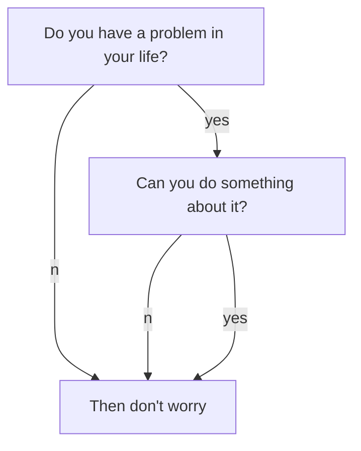

春节假期想干点儿轻松的，翻译+记笔记使我快乐。

---

# 一些HighLight

 - 

---

# DeepSeek-V3

## 1.Abstract

DeepSeek-V3是混合专家（MoE）语言模型，总参数量6710亿，其中每个token激活参数量为370亿。为实现高效推理与经济训练，DeepSeek-V3沿用了在DeepSeek-V2中经过充分验证的多头潜在注意力（MLA Multi-head Latent Attention）架构与DeepSeekMoE架构，并开创性地引入无辅助损失的负载均衡策略（an auxiliary-loss-free strategy for load balancing），同时采用multi-token prediction训练目标以提升模型性能。我们基于14.8万亿高质量多源语料对DeepSeek-V3进行预训练，并通过监督微调与强化学习阶段充分释放其能力。综合评估表明，DeepSeek-V3不仅显著超越其他开源模型，性能更可媲美顶尖闭源模型。该模型的完整训练仅需278.8万H800 GPU小时，且训练过程异常稳定，全程未发生任何不可恢复的损失尖峰，也未进行任何回滚操作。
模型检查点已发布于：https://github.com/deepseek-ai/DeepSeek-V3

## 2.Introduction

近年来，大型语言模型（LLM）经历了快速迭代与进化（Anthropic, 2024；Google, 2024；OpenAI, 2024a），不断逼近通用人工智能（AGI）的边界。除闭源模型外，以DeepSeek系列（DeepSeek-AI, 2024a,b,c；Guo等，2024）、LLaMA系列（AI@Meta, 2024a,b；Touvron等，2023a,b）、Qwen系列（Qwen, 2023, 2024a,b）及Mistral系列（Jiang等，2023；Mistral, 2024）为代表的开源模型也取得显著进展，持续缩小与闭源模型的差距。为进一步突破开源模型能力边界，我们通过scale up 推出DeepSeek-V3——总参数量达6710亿的混合专家（MoE）模型，其中每个token激活参数量为370亿。

基于前瞻性视角，我们始终追求卓越性能与经济成本的平衡。因此，在架构层面，为了实现高效推理，沿用多头潜在注意力（MLA）（DeepSeek-AI, 2024c），为了高效训练，仍沿用DeepSeekMoE架构（Dai等，2024）。这两项技术经过了DeepSeek-V2验证。在此基础上，我们引入两项创新策略：首先，DeepSeek-V3 引入了一种不依赖辅助损失（auxiliary-loss-free）的负载均衡策略（Wang 等, 2024a），旨在最大程度地降低为实现负载均衡而对模型性能产生的负面影响。其次，DeepSeek-V3 采用了多 token 预测的训练目标，我们观察到这一策略有助于提升在各项评测基准上的整体表现。

通过FP8混合精度训练框架实现训练加速与显存优化。低精度训练作为高效训练的有效方案（Dettmers等，2022；Kalamkar等，2019；Narang等，2017；Peng等，2023b），其发展与硬件能力演进密切关联（Luo等，2024；Micikevicius等，2022；Rouhani等，2023a）。本研究首次在超大规模模型上验证FP8训练的有效性，通过FP8计算与存储支持实现训练速度提升与显存占用降低。

为了实现高效训练，我们支持 FP8 混合精度训练，并对训练框架进行全面优化。低精度训练已经成为提升训练效率的有力解决方案（Dettmers 等, 2022；Kalamkar 等, 2019；Narang 等, 2017；Peng 等, 2023b），其发展与硬件能力的进步密切相关（Luo 等, 2024；Micikevicius 等, 2022；Rouhani 等, 2023a）。在本研究中，我们首次在超大规模模型上引入并验证了 FP8 混合精度训练框架的有效性。通过支持 FP8 的计算与存储，我们不仅加速了训练速度，还减少了 GPU 内存的占用。在训练框架方面，我们设计了 DualPipe 算法以实现高效的流水线并行。该算法减少了pipeline bubbles，并通过计算与通信的重叠（computation-communication overlap）在训练过程中隐藏了大部分通信开销。这种方式可以保证在模型规模进一步扩张时，只要维持恒定的计算与通信比率，仍能在跨节点间使用细粒度专家fine-grained experts，并将 all-to-all 通信的开销降至近乎为零。此外，我们还开发了高效的跨节点 all-to-all 通信内核，以充分利用 InfiniBand (IB) 与 NVLink 的带宽。我们也对内存占用进行了精细化优化，使得在不依赖高成本张量并行的情况下，依然可以训练 DeepSeek-V3。通过这些努力，我们实现了高效的训练过程。

在预训练阶段，我们使用 14.8T 高质量且多样化的 token 对 DeepSeek-V3 进行训练，整个预训练过程十分稳定。期间没有出现无法恢复的损失爆增，也无需回退。接下来，我们对 DeepSeek-V3 进行了两阶段的上下文长度扩展：第一阶段将最大上下文长度扩展至 32K，第二阶段进一步扩展至 128K。随后，我们对 DeepSeek-V3 的基础模型进行后训练（post-training），包括有监督微调（SFT）和强化学习（RL），以使其更贴合人类偏好并进一步释放模型潜力。在后训练阶段，我们从 DeepSeek-R1 系列模型中蒸馏其推理能力，并在此过程中谨慎地平衡模型的准确性与生成长度。

我们在大量基准上对 DeepSeek-V3 进行了全面评估。虽然训练成本较为经济，但综合评测结果显示，DeepSeek-V3-Base 已成为目前最强的开源基础模型，尤其在代码与数学方面表现突出。其聊天版本在多项标准和开放式基准上也优于其他开源模型，并在性能上可比肩主流闭源模型（包括 GPT-4o 和 Claude-3.5-Sonnet）。

最后，我们再次强调 DeepSeek-V3 所具有的经济训练成本（见表 1），这是通过算法、框架与硬件的协同优化共同实现的。在预训练阶段，DeepSeek-V3 每训练 1 万亿个 token 仅需消耗 18 万个 H800 GPU 小时；换言之，在拥有 2048 张 H800 GPU 的集群上只需运行 3.7 天即可完成。这使得整个预训练阶段在不到两个月的时间内完成，耗费了共 266.4 万 GPU 小时。再加上上下文长度扩展所用的 11.9 万 GPU 小时以及后训练所需的 0.5 万 GPU 小时，DeepSeek-V3 的完整训练总耗时仅为约 278.8 万 GPU 小时。若按每 GPU 小时 2 美元的租用价格计算，总训练成本仅为 557.6 万美元。需要注意的是，上述成本仅包括 DeepSeek-V3 的正式训练，不包含在模型架构、算法或数据等方面进行前期研究和消融实验的费用。

核心创新贡献如下：

**Architecture: Innovative Load Balancing Strategy and Training Objective**

 - 在 DeepSeek-V2 高效架构的基础上，我们率先提出了一种不依赖辅助损失的负载均衡策略，最大限度地减少了为实现负载均衡而导致的模型性能损失。

 - 我们探索了Multi-Token Prediction（MTP）目标，并证明它可以提高模型性能。同时，该目标也可用于推理加速中的推测解码（speculative decoding）。

**Pre-Training: Towards Ultimate Training Efficiency**

 - 我们设计了一套 FP8 混合精度训练框架，并首次在超大规模模型上验证了 FP8 训练的可行性与有效性。

 - 通过算法、框架与硬件的协同设计，我们突破了跨节点 MoE 训练中的通信瓶颈，实现了几乎完全的计算与通信重叠。此举不仅大幅提升了训练效率并降低了训练成本，也使得我们可以在不增加额外开销的情况下进一步扩大模型规模。

 - 仅用 266.4 万个 H800 GPU 小时的经济成本，我们完成了 DeepSeek-V3 在 14.8 万亿条文本上的预训练，打造了目前最强的开源基础模型。随后的后续训练阶段仅需 10 万个 GPU 小时。

**Post-Training: Knowledge Distillation from DeepSeek-R1**

 - 我们提出了一种创新方法，将CoT模型（Chain-of-Thought,DeepSeek-R1 系列模型之一）中的推理能力蒸馏到标准大语言模型中，尤其是 DeepSeek-V3。该流程将 R1 模型的验证与反思模式优雅地融合至 DeepSeek-V3，显著提升了其推理性能。同时，我们也对 DeepSeek-V3 的输出风格与长度加以控制。

**核心评测结果概览**

 - 知识：在 MMLU、MMLU-Pro 与 GPQA 等教育类基准上，DeepSeek-V3 超越了所有其他开源模型，分别取得了 88.5、75.9 和 59.1 的成绩，其表现可与 GPT-4o 和 Claude-Sonnet-3.5 等领先闭源模型相媲美，进一步缩小了开源与闭源模型在此领域的差距。
在客观事实相关基准上，DeepSeek-V3 在 SimpleQA 与 Chinese SimpleQA 两个数据集中均优于其他开源模型。尽管在英文事实类知识（SimpleQA）方面仍略逊于 GPT-4o 与 Claude-Sonnet-3.5，但在中文事实类知识（Chinese SimpleQA）上却超过了这些模型，展现出其在中文事实类知识方面的优势。

 - 代码、数学与推理：在数学相关基准上，DeepSeek-V3 在所有non-long-CoT的开源与闭源模型中取得了最先进的表现。值得注意的是，针对部分基准（如 MATH-500），其表现甚至超过了 o1-preview，展现了强大的数学推理能力。在编程相关任务上，DeepSeek-V3 在编程竞赛基准（如 LiveCodeBench）中取得最佳表现，牢牢占据该领域的领先地位。对于工程类任务，虽然 DeepSeek-V3 略低于 Claude-Sonnet-3.5，但依然远超其他所有模型，体现了其在多样化技术基准上的竞争力。

在后续的内容中，我们将首先详细介绍 DeepSeek-V3 的模型架构（第 2 节），包括高效推理所用的 Multi-head Latent Attention (MLA)（DeepSeek-AI, 2024c）以及经济训练所用的 DeepSeekMoE（Dai 等, 2024）等。随后，我们介绍所使用的基础设施，包括计算集群、训练框架、对 FP8 训练的支持、推理部署策略及未来硬件设计建议。接着，我们阐述预训练流程，包括训练数据的构建、超参数设置、长上下文扩展技术及相关评测与讨论（第 4 节）。然后，我们讨论后训练工作，包括有监督微调（SFT）、强化学习（RL）以及相应的评测与讨论（第 5 节）。最后，我们总结本项研究的结论，探讨 DeepSeek-V3 目前存在的限制并展望未来可能的研究方向（第 6 节）。

## 3.Architecture

我们首先介绍 DeepSeek-V3 的基本架构，其中采用了 Multi-head Latent Attention (MLA)（DeepSeek-AI, 2024c）来实现高效推理，并使用 DeepSeekMoE（Dai 等, 2024）来降低训练成本。随后，我们将介绍多 Token 预测（MTP）训练目标，该目标在评测基准上能够提升模型整体性能。除非另有说明，DeepSeek-V3 的其他细节均与 DeepSeek-V2（DeepSeek-AI, 2024c）中的设置保持一致。

### 3.1 基本架构

DeepSeek-V3 的整体框架仍然基于 Transformer（Vaswani 等, 2017）。为了实现高效推理与经济可控的训练成本，DeepSeek-V3 继续沿用 MLA 和 DeepSeekMoE，这两种方法在 DeepSeek-V2 中已得到充分验证。与 DeepSeek-V2 相比，主要的区别在于，我们在 DeepSeekMoE 中额外引入了一种无辅助损失（auxiliary-loss-free）的负载均衡策略（Wang 等, 2024a），以减轻因实现负载均衡而导致的性能下降。图 2 展示了 DeepSeek-V3 的基本架构，本节我们将简要回顾 MLA 与 DeepSeekMoE 的相关细节。

#### 3.1.1 Multi-Head Latent Attention

在注意力（attention）机制上，DeepSeek-V3 采用 MLA 架构。记 $d$ 表示嵌入维度（embedding dimension），$n_h$ 表示注意力头的数量，$d_h$ 表示每个注意力头的维度， $\mathbf{h}_t \in \mathbb{R}^d$ 表示给定的注意力层中第t个token对应的attention输入。 【self attention，q k v都是这个h】 MLA的核心在于对key和value的低秩联合压缩low-rank joint compression，从而在推理阶段减少Key-Value cache。

$$
\boxed{\textcolor{blue}{\mathbf{c}_{t}^{KV}}} = W^{DKV} \mathbf{h}_t \tag{1}
$$

$$
[\mathbf{k}_{t,1}^C; \mathbf{k}_{t,2}^C; \dots; \mathbf{k}_{t,n_h}^C] = \mathbf{k}_t^C = W^{UK} \mathbf{c}_{t}^{KV} \tag{2}
$$

$$
\boxed{\textcolor{blue}{\mathbf{k}_t^R}} = \text{RoPE}(W^{KR} \mathbf{h}_t) \tag{3}
$$

$$
\mathbf{k}_{t,i} = [\mathbf{k}_{t,i}^C; \mathbf{k}_{t}^R] \tag{4}
$$

$$
[\mathbf{v}_{t,1}^C; \mathbf{v}_{t,2}^C; \dots; \mathbf{v}_{t,n_h}^C] = \mathbf{v}_t^C = W^{UV} \mathbf{c}_{t}^{KV} \tag{5}
$$

其中， $\mathbf{c}_{t}^{KV} \in \mathbb{R}^{d_c}$ 是keys和values经过压缩的latent向量， $d_c$  为压缩维度； $W^{DKV} \in \mathbb{R}^{d_c \times d}$ 为向下投影矩阵（down-projection）， $W^{UK}, W^{UV} \in \mathbb{R}^{d_h n_h \times d_c}$ 分别是键和值的向上投影矩阵（up-projection）； $W^{KR} \in \mathbb{R}^{d_h^R \times d}\) 乘以原始输入计算旋转位置编码的key h后会送入RoPE函数，使其携带Rotary Positional Embedding (RoPE）； $\mathrm{RoPE}(\cdot)$ 表示将 RoPE 矩阵应用于输入向量，[·;·] 表示向量拼接。需要注意的是，对于 MLA，在推理时只需缓存蓝色框所示的向量（即 $\textcolor{blue}{\mathbf{c}_{t}^{KV}}$ 与 $\textcolor{blue}{\mathbf{k}_t^R}$），这大幅减少了 KV 缓存的大小，同时性能仍能与标准多头注意力（MHA, Vaswani 等, 2017）相当。

对于注意力查询（query）也进行低秩压缩，从而在训练阶段减小激活值（activation）所占的内存：  

$$
c_t^Q,t = W^{DQ} \mathbf{h}_t, \tag{6}
$$

$$
[\mathbf{q}_{t,1}^C; q_{t,2}^C; \dots; q_{t,n_h}^C] = q^C_t = W^{UQ} c_t^Q}, \tag{7}
$$

$$
[q^R_{t,1}; q^R_{t,2}; \dots; q^R_{t,n_h}]
=
q^R_t
=
\mathrm{RoPE}\bigl(W_{Q\!R} \, c_{Q,t}\bigr),
\tag{8}
$$

由此可得  
\[
q_{t,i} = [q^C_{t,i}; \, q^R_{t}],
\tag{9}
\]  
其中 \(c_{Q,t} \in \mathbb{R}^{d'_c}\) 表示查询向量的压缩潜在表示，\(d'_c(\ll d_h \cdot n_h)\) 为查询的压缩维度；\(W_{D\!Q} \in \mathbb{R}^{d'_c \times d}\) 与 \(W_{U\!Q} \in \mathbb{R}^{d_h n_h \times d'_c}\) 分别是对查询向量的向下和向上投影矩阵；\(W_{Q\!R} \in \mathbb{R}^{d_R n_h \times d'_c}\) 用于生成携带 RoPE 的“解耦”查询向量。

最终，注意力的输出向量 \(u_t\) 由查询 \(q_{t,i}\)、键 \(k_{t,i}\) 与值 \(v^C_{t,i}\) 共同计算得到：  
\[
o_{t,i} = \sum_{j=1}^{\,}
\mathrm{Softmax}_j\!
\bigl(\frac{q_{t,i}^T\,k_{j,i}}{\sqrt{d_h + d_R}}\bigr)
\, v^C_{j,i},
\tag{10}
\]  
\[
u_t = W_{O} \,[o_{t,1}; o_{t,2}; \dots; o_{t,n_h}],
\tag{11}
\]  
其中 \(W_{O} \in \mathbb{R}^{d \times (d_h n_h)}\) 是输出投影矩阵。

以上便是 MLA 的主要细节。通过这种低秩压缩策略，我们既能在推理阶段大幅减少键值缓存的占用，又能在训练时有效降低内存消耗，从而在保持高性能的同时实现高效率与低成本。

高斯积分：

$$
\int_{-\infty}^{\infty} e^{-x^2} dx = \sqrt{\pi}
$$

矩阵乘法：

$$
\begin{bmatrix}
1 & 2 \\
3 & 4 
\end{bmatrix}
\times
\begin{bmatrix}
a & b \\
c & d 
\end{bmatrix}
=
\begin{bmatrix}
1a+2c & 1b+2d \\
3a+4c & 3b+4d 
\end{bmatrix}
$$

When $$a \ne 0$$, there are two solutions to $$ax^2 + bx + c = 0$$ and they are

$$x_1 = {-b + \sqrt{b^2-4ac} \over 2a}$$

$$x_2 = {-b - \sqrt{b^2-4ac} \over 2a} \notag$$

# 参考文献

