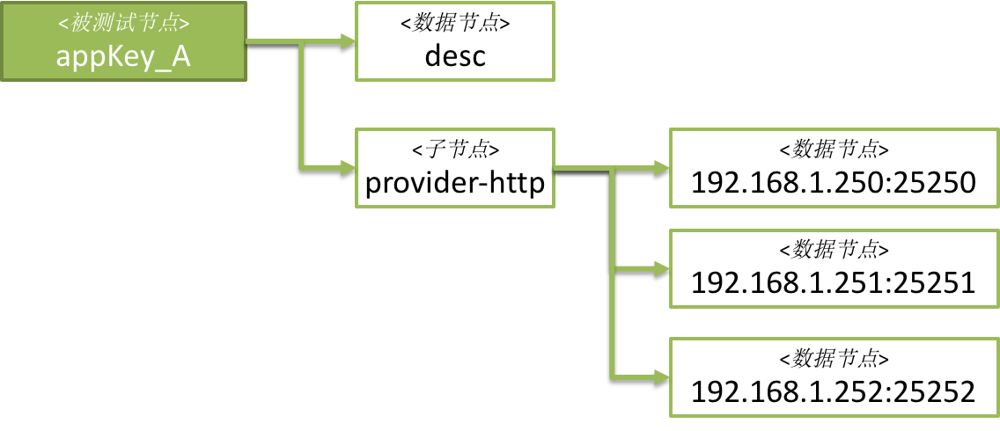

## 1. 啥子是Zookeeper

Zookeeper昵称ZK，是一个开源的分布式应用程序协调服务，主要用来解决分布式应用中经常遇到的一些数据管理问题，如：统一命名服务、状态同步服务、集群管理、分布式应用配置项的管理等。

 Zk的数据存储结构类似于文件系统的目录树；ZK的数据存储于内存之中，因此能够达到高吞吐与低延迟；ZK服务节点是多replica去中心化部署的。

Learn more about ZK from: https://cwiki.apache.org/confluence/display/ZOOKEEPER/Index

## 2. 啥子是Watcher

我们先来围观下ZK提供的API：

写数据API有create、delete、setData三种(忽略ACL相关操作)，每种操作都提供了同步接口和异步接口：

```
ZOOAPI int zoo_acreate(zhandle_t *zh, const char *path, const char *value, 
        int valuelen, const struct ACL_vector *acl, int flags,
        string_completion_t completion, const void *data);

ZOOAPI int zoo_adelete(zhandle_t *zh, const char *path, int version, 
        void_completion_t completion, const void *data);
ZOOAPI int zoo_aset(zhandle_t *zh, const char *path, const char *buffer, int buflen, 
        int version, stat_completion_t completion, const void *data);
```

那么问题来了

Q：如果client对某个path下的数据感兴趣，那肿么才能得及时感知到数据变化事件呢？

A：client可以在指定path下注册watcher，一旦关心的event发生，ZK负责回调注册了watcher的client将这一事件及时告知。

watcher是在调用getter接口时注册到ZK上的，读API包括exists，getData，getChildren三种( 忽略ACL相关操作)，每种操作也都提供了同步接口和异步接口：

```
// \brief checks the existence of a node in zookeeper.
ZOOAPI int zoo_aexists(zhandle_t *zh, const char *path, int watch, 
        stat_completion_t completion, const void *data);
ZOOAPI int zoo_awexists(zhandle_t *zh, const char *path, 
        watcher_fn watcher, void* watcherCtx, 
        stat_completion_t completion, const void *data);
 
// \brief gets the data associated with a node.
ZOOAPI int zoo_aget(zhandle_t *zh, const char *path, int watch, 
        data_completion_t completion, const void *data);
ZOOAPI int zoo_awget(zhandle_t *zh, const char *path, 
        watcher_fn watcher, void* watcherCtx, 
        data_completion_t completion, const void *data);
 
// \brief lists the children of a node.
ZOOAPI int zoo_aget_children(zhandle_t *zh, const char *path, int watch, 
        strings_completion_t completion, const void *data);
ZOOAPI int zoo_awget_children(zhandle_t *zh, const char *path,
        watcher_fn watcher, void* watcherCtx, 
        strings_completion_t completion, const void *data);
```

可选择添加指定watcher还是默认watcher。默认watcher是只在ZooKeeper zk = new ZooKeeper(serverList, sessionTimeout, watcher)中指定的watch。

对于有int watch参数的getter方法，watch参数传入true则会将默认watcher注册为所关注事件的watcher；传入false则不注册任何watcher。

watcher定义如下：

```
/**
 * \brief signature of a watch function.
 * 
 * There are two ways to receive watch notifications: legacy and watcher object.
 * <p>
 * The legacy style, an application wishing to receive events from ZooKeeper must 
 * first implement a function with this signature and pass a pointer to the function 
 * to \ref zookeeper_init. Next, the application sets a watch by calling one of 
 * the getter API that accept the watch integer flag (for example, \ref zoo_aexists, 
 * \ref zoo_get, etc).
 * <p>
 * The watcher object style uses an instance of a "watcher object" which in 
 * the C world is represented by a pair: a pointer to a function implementing this
 * signature and a pointer to watcher context -- handback user-specific data. 
 * When a watch is triggered this function will be called along with 
 * the watcher context. An application wishing to use this style must use
 * the getter API functions with the "w" prefix in their names (for example, \ref
 * zoo_awexists, \ref zoo_wget, etc).
 * 
 * \param zh zookeeper handle
 * \param type event type. This is one of the *_EVENT constants. 
 * \param state connection state. The state value will be one of the *_STATE constants.
 * \param path znode path for which the watcher is triggered. NULL if the event 
 * type is ZOO_SESSION_EVENT
 * \param watcherCtx watcher context.
 */
typedef void (*watcher_fn)(zhandle_t *zh, int type, 
        int state, const char *path,void *watcherCtx);
```

## 3. 各种Event

ZK Event有如下6种，我们将测试前4种：

| 事件                  | 说明                                                         | 值                               |
| --------------------- | ------------------------------------------------------------ | -------------------------------- |
| ZOO_CREATED_EVENT     | \brief a node has been created. * This is only generated by watches on non-existent nodes. These watches are set using \ref zoo_exists. | #define CREATED_EVENT_DEF 1      |
| ZOO_DELETED_EVENT     | \brief a node has been deleted. * This is only generated by watches on nodes. These watches are set using \ref zoo_exists and \ref zoo_get. | #define DELETED_EVENT_DEF 2      |
| ZOO_CHANGED_EVENT     | \brief a node has changed. * This is only generated by watches on nodes. These watches are set using \ref zoo_exists and \ref zoo_get. | #define CHANGED_EVENT_DEF 3      |
| ZOO_CHILD_EVENT       | \brief a change as occurred in the list of children. * This is only generated by watches on the child list of a node. These watches are set using \ref zoo_get_children or \ref zoo_get_children2. | #define CHILD_EVENT_DEF 4        |
| ZOO_SESSION_EVENT     | \brief a session has been lost. * This is generated when a client loses contact or reconnects with a server. | #define SESSION_EVENT_DEF -1     |
| ZOO_NOTWATCHING_EVENT | \brief a watch has been removed. * This is generated when the server for some reason, probably a resource constraint, will no longer watch a node for a client. | #define NOTWATCHING_EVENT_DEF -2 |

其中，node has changed感知的是节点数据的变化，节点数据由两部分组成：节点值和节点状态。节点状态有如下几个字段：

| ZooKeeper Stat Structure |                                                              |
| ------------------------ | ------------------------------------------------------------ |
| czxid                    | The zxid of the change that caused this znode to be created. |
| mzxid                    | The zxid of the change that last modified this znode.        |
| ctime                    | The time in milliseconds from epoch when this znode was created. |
| mtime                    | The time in milliseconds from epoch when this znode was last modified. |
| version                  | The number of changes to the data of this znode.             |
| cversion                 | The number of changes to the children of this znode.         |
| aversion                 | The number of changes to the ACL of this znode.              |
| ephemeralOwner           | The session id of the owner of this znode if the znode is an ephemeral node.If it is not an ephemeral node, it will be zero. |
| dataLength               | The length of the data field of this znode.                  |
| numChildren              | The number of children of this znode.                        |

 

## 4. 触发条件测试

测试数据结构为：



观测节点均为appKey_A节点，测试步骤及结果见下表：

| 操作                                        | ZOO_CREATED_EVENT        | ZOO_DELETED_EVENT     | ZOO_CHANGED_EVENT             | ZOO_CHILD_EVENT |
| ------------------------------------------- | ------------------------ | --------------------- | ----------------------------- | --------------- |
| zoo_wexists("/appKey_A")                    | zoo_wexists("/appKey_A") | zoo_wget("/appKey_A") | zoo_get_children("/appKey_A") |                 |
| create appKey_A                             | yes                      | X                     | X                             | X               |
| create appKey_A/desc【增加子节点】          | X                        | X                     | yes                           | yes             |
| set  appKey_A/desc【子节点value变化】       | X                        | X                     | X                             | X               |
| create appKey_A/provider-http               | X                        | X                     | yes                           | yes             |
| create appKey_A/provider-http/192.168.1.250 | X                        | X                     | X                             | X               |
| set  appKey_A/provider-http/192.168.1.250   | x                        | x                     | x                             | x               |
| delete appKey_A/desc                        | X                        | X                     | yes                           | yes             |
| delete appKey_A/provider-http/192.168.1.250 | X                        | X                     | X                             | X               |
| delete appKey_A/provider-http               | X                        | X                     | yes                           | yes             |
| delete appKey_A                             | X                        | yes                   | yes                           | X               |

 